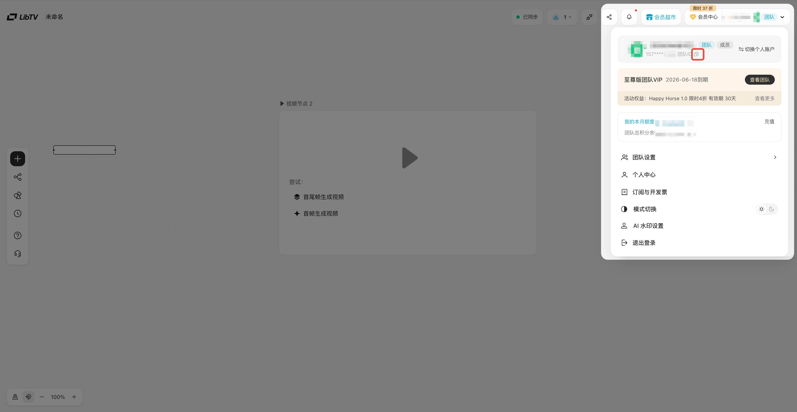
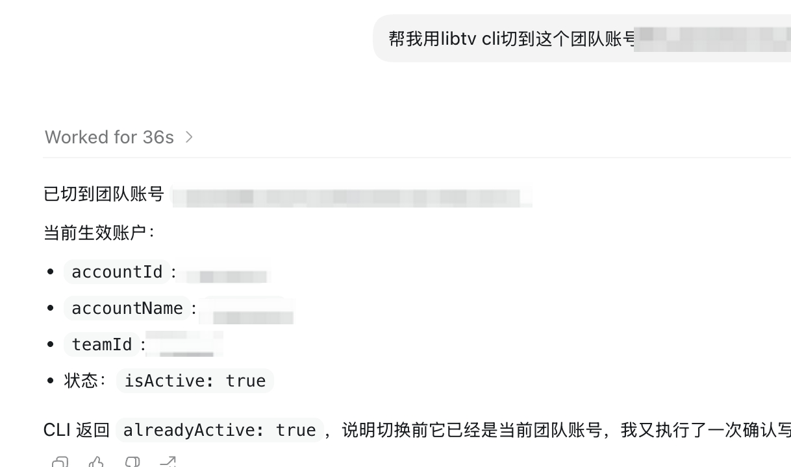

# LibTV CLI 使用指南

更新时间：2026\-05\-27

[LibTV CLI 官网](https://www.liblib.tv/cli)

旧版文档连接：[🔧LibTV skill  使用指南](https://resonate.feishu.cn/wiki/OwYKwl4xoiywU5kklrrcAyVDn7d)

## LibTV CLI：让每个 AI Agent 完美驾驭 LibTV 无限画布

你的 AI Agent 已经很会想创意、写脚本、拆分镜、改 prompt，但它还缺少一个真正进入生产级视频创作平台的入口。

LibTV CLI 就是这个入口。装上之后，Agent 不再停留在“给你一段建议”或“让你复制一段 prompt”，而是可以直接在 LibTV 中创建项目、搭建画布、上传素材、创建节点、连接工作流、调用模型生成图片和视频。

以前是你手动把想法搬进 LibTV；现在可以通过 Agent 直接把创作过程落到 LibTV 画布里。你只需要 **提出方向、提供方法、确认结果、继续创作。**

## 这会改变什么

LibTV CLI 把 AI Agent 从“创意建议者”推进到“创作协作者”。

装好之后，你仍然只需要用自然语言和 Agent 对话：

```Plain Text
帮我做一个 30 秒的产品广告片。
参考这段视频的节奏，产品换成我的耳机。
最后给我一个能继续编辑的 LibTV 画布链接。
```

不同的是，这一次 Agent 可以根据你的要求把任务拆成真实的 LibTV 工作流：

- 创建一个可继续编辑的 LibTV 项目画布

- 把脚本、分镜、参考图、视频 prompt 和生成结果放到画布节点里

- 使用画布中的各种节点能力，如：角色三视图、九宫格、高清、扩图

- 自动给节点进行合适的命名和位置编排

- 连接素材、模型和下游生成任务

- 查询进度、定位失败节点、必要时重试

- 返回项目链接、最终视频和过程摘要

最终得到的不只是一个聊天回复或一个孤立视频链接，而是一张可以继续查看、修改和复用的 LibTV 创作画布。

这份文档面向未来的 LibTV CLI 用户。无论你是已经在用 LibTV 画布的创作者，还是因为视频工具太复杂一直没开始的人，或者是很会用 AI、会写 Skill、会搭自己 Agent 的用户，CLI 都是在解决同一个问题：让 AI 的创作能力真正接上 LibTV 的执行环境。

## 

## 一句话开始

你可以直接把下面这句话发给你的 AI Agent：

```Plain Text
帮我安装并配置 LibTV CLI。配置完成后，帮我登录 LibTV，并创建一个测试画布确认可以正常操作。
```

安装完成后，你就可以直接说创作需求：

```Plain Text
帮我做一个 30 秒的短漫剧，主题是“井底之蛙的 AI 版”。
请把完整创作过程放到 LibTV 画布上，并返回项目链接和最终视频。
```

## 谁会用到它

### 已经在用 LibTV 画布，但觉得操作太重的创作者

你可能已经熟悉 LibTV 的画布、节点和模型能力，但真实创作时仍然很容易被流程拖慢：

- 脚本、分镜、图片 prompt、视频 prompt 要来回复制

- 一个项目里要建很多节点、连很多线

- 参考图和视频结果多了以后，很难保持清楚的结构

- 失败节点需要一个个点开排查

- 多版本尝试很难整理成可复用的工作流

创建项目、批量建节点、使用画布工具、连接依赖、触发生成、检查失败 —— **把繁琐操作交给 Agent，你只需要判断创作方向和结果质量，并找回创作的乐趣**

### 很会用 AI，或者正在搭自己工作流的用户

你可能已经习惯用 Codex、Claude Code、Cursor、Trae 或其他 Agent 写文案、改代码、做方案；也可能已经开始写自己的 prompt / Skill，把多个工具串成一套固定工作流。

这些 AI 工具和自定义工作流已经很会帮你想：

- 故事怎么写

- 镜头怎么拆

- prompt 怎么改

- 广告片怎么复刻

- 让 Agent 读取本地文件、处理素材、生成脚本和分镜

- 给团队做一套固定的视频生产流程

但如果没有 CLI，这些能力最后还是会卡在“怎么真正生成视频、怎么把过程放进画布、怎么让结果可追踪”上。

LibTV CLI 把 LibTV 项目、节点、素材、模型和生成任务变成 Agent 可以调用的工具。你可以直接让通用 Agent 使用它，也可以把它放进自己的 Skill、Agent、脚本或自动化流程里，让“AI 想好了”进一步变成“AI 已经在 LibTV 里搭好了”。

## 能做什么

## 可以直接这样用

下面这些是你在连接 LibTV CLI 并登录后，可以直接发给 Agent 的完整任务示例。

### 产品广告片复刻

```Plain Text
我会提供一个参考广告视频和一张产品图。

请用 LibTV CLI 新建一个 LibTV 项目，完成一支 30 秒产品广告片：
1. 先分析参考视频的节奏、镜头结构、转场方式、产品展示时机和情绪曲线；
2. 把产品替换成我提供的产品图，不要照搬原视频品牌元素；
3. 在画布里创建脚本节点、镜头拆解节点、产品视觉参考节点、关键画面节点和视频生成节点；
4. 每个视频节点都要写清楚参考图用途、时间段、镜头运动和产品露出方式；
5. 先搭好完整画布结构，等我确认无误后再开始生成；
6. 最后返回 LibTV 项目链接、最终视频链接、主要节点摘要和失败节点说明。
```

### 短剧第一集完整章节画布

```Plain Text
请用 LibTV CLI 帮我创建一个短剧第 1 集项目，主题是：
“一个被全公司忽视的实习生，突然发现自己能看到每个人今天会撒的第一个谎。”

要求：
1. 先生成 1 集 60-90 秒的故事方案，包括开场钩子、主角目标、阻力、反转和结尾钩子；
2. 再生成可拍摄分镜，按 6-10 个视频 Unit 拆分；
3. 在 LibTV 画布里创建：故事大纲节点、剧本节点、分镜节点、角色参考节点、场景参考节点、每个 Unit 的图片节点和视频节点；
4. 每个 Unit 视频节点要继承对应分镜，不要只写剧情摘要；
5. 如果生成中有节点失败，不要重做整张画布，先定位失败节点并给出重试策略；
6. 交付时返回项目链接、最终视频、Unit 列表、失败节点和下一步可继续编辑建议。
```

### 多参考图角色一致性视频

```Plain Text
我会提供 3 张参考图：
1. 角色 A 正面图；
2. 角色 B 正面图；
3. 一个室内场景参考图。

请用 LibTV CLI 创建一个项目，生成一段 8-12 秒的双人对话视频：
1. 上传三张参考图，并在画布中明确命名；
2. 创建一个文本节点说明引用关系：角色 A、角色 B、场景分别对应哪张图；
3. 创建视频节点时，把最关键的角色图放在最明确的引用位置，并在 prompt 里写清楚每张参考图的用途；
4. 视频内容是：角色 A 站在门口犹豫，角色 B 坐在桌边抬头看她，两人短暂停顿后，角色 A 走进房间；
5. 要求不要混淆两个角色身份，不要把两个人脸融合，不要改变室内空间方向；
6. 完成后返回项目链接、视频链接、引用图顺序和模型执行结果。
```

### 已有画布分析与调整

```Plain Text
这是我的 LibTV 项目链接：【粘贴链接】。

请用 LibTV CLI 先诊断这个项目，不要立刻重跑：
1. 列出画布里的主要分组和节点；
2. 找出空节点、失败节点、没有结果 URL 的图片 / 视频节点；
3. 检查视频节点是否有上游参考图，prompt 是否说明了每张图的用途；
4. 判断失败原因更像是安全审核、模型能力、素材缺失、引用顺序错误，还是 prompt 写得不清楚；
5. 给出一个最小补救方案：哪些节点需要补内容、哪些节点需要重连、哪些节点需要重跑；
6. 等我确认后，再执行修复。
```

### 团队固定工作流模板

```Plain Text
请用 LibTV CLI 帮我们创建一个团队可复用的“短视频生产模板项目”。

模板里先不要生成正式视频，只搭好画布结构：
1. 左侧放输入区：用户需求、参考素材、品牌 / 风格约束；
2. 中间放规划区：故事大纲、脚本、分镜、角色与场景设定；
3. 右侧放生产区：图片参考节点、视频生成节点、失败重跑区、最终成片区；
4. 每个节点都写入示例说明，告诉团队成员应该填什么；
5. 用清楚的分组和命名，让新人打开画布也能看懂流程；
6. 最后返回项目链接，并总结这张模板画布适合哪些任务、哪些部分需要人工补充。
```

### 有自己 Skill 的全流程创作

```Plain Text
请用 LibTV CLI 和你可用的多个 Skill，帮我完成一个完整视频项目。

主题：
一个普通上班族突然发现，自己每天只能说三句真话。

目标：
做一条 60 秒左右的剧情短片，适合竖屏短视频平台。

请按以下阶段执行：

阶段 1：加载剧本 Skill
- 先用剧本 / 叙事 Skill 生成 3 个故事方向；
- 每个方向都要包含开场钩子、主角目标、阻力、反转和结尾；
- 选出最适合 60 秒短视频的一版，并说明为什么选它。

阶段 2：加载剧本细化 Skill
- 把选中的方向扩展成完整短片剧本；
- 输出标题、人物表、场景表、完整对白和动作；
- 控制在 60 秒左右，不要写成长剧简介。

阶段 3：加载分镜 Skill
- 把剧本拆成 6-10 个视频 Unit；
- 每个 Unit 写清楚画面内容、镜头景别、人物动作、情绪变化、声音或字幕提示；
- 标注每个 Unit 预计时长和它在故事里的作用。

阶段 4：加载视觉资产 Skill
- 为主角、关键道具和主要场景生成视觉设定；
- 输出角色参考图 prompt、场景参考图 prompt、道具参考图 prompt；
- 说明哪些资产需要跨 Unit 保持一致。

阶段 5：加载图片 / 视频 Prompt Skill
- 为每个 Unit 生成图片参考 prompt；
- 为每个 Unit 生成视频 prompt；
- 视频 prompt 必须继承分镜语言，不能只写剧情摘要；
- 如果使用参考图，必须说明每张参考图在视频里的用途。

阶段 6：使用 LibTV CLI 创建项目和画布
- 创建一个新的 LibTV 项目；
- 在画布中建立分组：输入区、剧本区、分镜区、视觉资产区、Unit 图片区、Unit 视频区、质检与重跑区、最终成片区；
- 把前面阶段的所有产物写入对应节点；
- 创建图片和视频生成节点，并连接真实依赖关系；
- 节点命名要清楚，不要堆在一起。

阶段 7：生成图片和视频
- 先生成角色、场景、道具等关键参考图；
- 再生成每个 Unit 的图片参考；
- 最后生成每个 Unit 的视频；
- 如果某个节点失败，记录失败原因，不要直接重建整张画布。

阶段 8：加载质检 / 修复 Skill
- 检查最终结果是否符合故事、分镜和视觉一致性要求；
- 找出失败节点、空节点、引用错误、人物不一致、镜头不连贯等问题；
- 给出最小修复方案，并在我确认后执行重跑。

最终交付：
1. LibTV 项目链接；
2. 最终视频链接；
3. 剧本摘要；
4. Unit 列表；
5. 主要视觉资产清单；
6. 失败节点和修复记录；
7. 下一步可以继续优化的建议。
```

## 常见问题

### 我需要学命令行吗？

不需要。

CLI 是给 Agent 用的。你只需要安装和登录一次，后面继续用自然语言描述创作需求。

### 登录和使用积分还需要 Access Key 吗？

不需要。

LibTV CLI 可以直接在 Agent 中触发浏览器登录。你在浏览器里完成登录后，登录状态会返回给 Agent，之后 Agent 就可以使用这个已登录账号在授权范围内使用积分以及进行创作了。

### 积分消耗如何计算？

通过 LibTV CLI 或 Skills 发起的调用，将使用所登录账户的积分，和你在画布中生成对应节点消耗的积分相同。

### 如何在 CLI 中切换团队/个人空间

CLI 的登录状态依赖你登录 CLI 时浏览器里的 LibTV 登录状态。

CLI 使用的账号和空间，也同样依赖你登录 CLI 时浏览器中的账号与空间状态。也就是说，你在浏览器里切换账号，或者切换团队空间 / 个人空间，都会影响 CLI 后续的登录状态、可访问项目和操作权限。

如果你希望 CLI 使用指定的个人空间或团队空间，建议先在浏览器里切换到对应账号和空间，再进行 CLI 登录或重新登录。同时，也建议把希望切换到的「个人 ID」或「团队 ID」复制给 Agent，让 Agent 帮你核对浏览器当前登录状态、空间状态和你期望 CLI 使用的状态是否一致。





### 为什么 Agent 使用 CLI 时偶尔会报错？

LibTV CLI 内部提供的项目、画布、节点、素材、模型调用、状态查询等基础能力是比较完整的。但 CLI 是给不同 AI Agent、不同模型和不同脚本工作流调用的，实际使用中出现报错，不一定代表 CLI 本身缺少能力。

常见原因包括：

- Agent 没有正确理解需求或当前画布状态

- 模型把参数、节点类型或引用关系写错了

- prompt 没有说清楚生成目标、参考图用途或视频节点要求

- 自定义 Skill / 脚本没有按 CLI 的真实命令和参数调用

- 当前模型对复杂多图、多角色、多步骤任务的理解能力不足

- 生成任务遇到安全审核、模型异常、网络波动或临时服务不稳定

遇到这类情况，建议先让 Agent 做一次诊断：

- 读取报错信息和失败节点

- 查询项目、节点和任务状态

- 判断问题更像是参数、引用、模型、素材、审核还是临时异常

- 修正脚本或 prompt 后重试

很多问题通过多诊断一次、多试几次，或者把需求说得更具体，就可以解决。如果连续多次失败，再把项目链接、节点信息、报错内容和操作步骤一起反馈给官方，方便定位。

### 为什么一定要把过程放到画布？

因为视频创作不是一次性文本回复。

画布可以保存：

- 脚本

- 分镜

- 参考图

- 视频节点

- 上下游依赖

- 失败节点

- 可继续编辑的中间结果

只返回一个视频链接，后续很难修改、追踪和复用。

### 生成任务很慢怎么办？

视频生成本身可能需要较长时间。短视频任务通常也可能等待十几分钟到更久，高峰期会更慢。

建议：

- 先确认 Agent 已经把项目和节点创建好

- 让 Agent 查询节点状态，而不是重复提交任务

- 长任务可以后台等待，过一段时间再让 Agent 检查结果

### 失败会扣算力吗？

具体以 LibTV 当前产品规则为准。一般生成失败、审核拦截、模型异常等场景可能有返还机制，但不要把“失败一定不消耗”当成固定承诺。

如果遇到疑似误扣，保留项目链接、节点信息、任务时间和失败原因，再反馈给官方。

### 如何取消登录、解除绑定和授权？

你可以直接对已连接 LibTV CLI 的 Agent 说：

`LibTV CLI 取消登录，解除绑定和授权。`

或者

`libtv project unuse`

`libtv logout`

Agent 会清除本机 CLI 登录凭据，并解除当前工作目录与 LibTV 项目的绑定。完成后，可以让 Agent 验证：

- CLI 是否已经无法读取当前账号信息

- 本机登录凭据是否已经被删除

- 是否还能继续读取项目列表或操作画布

如果取消后 CLI 已经提示未登录，且当前目录没有项目绑定，说明这个 Agent 已经不能再使用你的 LibTV 账号继续操作。

## ⛲️许愿池 

想让 CLI 支持什么新能力？在[这里许个愿吧](https://resonate.feishu.cn/share/base/form/shrcn2ZNhAk7BaGIUonidocFoyd)。

## 更新日志

### V 1\.1\.1更新

> 2026年6月17日
> 
> 

- 优化 node \-\-run 说明和行为提示，避免调用方无意义轮循，节省调用方Token消耗。

- Seedance 2\.0 自动合规检测从图片扩展到图片、视频、音频参考素材。

- 生成失败时额外输出更明确的失败原因，方便用户定位问题。

- 优化 Node 引用的提示说明，让模型更好理解和写 prompt。


### V 1\.1\.0更新

> 2026年6月16日
> 
> 

- 新增 workspace 项目管理能力：支持创建、列表、更新、绑定/解绑项目空间。

- 画布命令支持按项目空间筛选和创建：project list/create 可通过 \-w/\-\-workspace 指定项目，也会自动读取当前目录绑定的项目。

- 优化节点引用写法：prompt 中可用 \{\{Node \<Node Key\>\}\} 或 \{\{Node "节点名"\}\} 引用已连接的上游节点，让模型更好理解和写入。

- 优化媒体连线后的顺序稳定性，避免图片、视频、音频参考素材顺序漂移。


### V 1\.0\.2更新

> 2026年6月10日
> 
> 

- 视频剪辑节点现在会在连线变化后自动维护视频/音频来源，减少手动配置出错。

- 多媒体参考资源现在会更稳定地保持顺序，支持图片、视频、音频混合参考。

- Prompt 中的资源引用会在删边或资源顺序变化后自动更新，避免出现引用错位或失效。

- model 参数现在支持直接填写模型展示名，使用体验更接近产品界面。

- 全能参考场景下，CLI 会自动整理混合参考资源，使生成请求更贴近 Web 端行为。

- 补充了脚本节点和合成节点的操作说明，方便按节点类型完成创建、更新、连线和运行。

