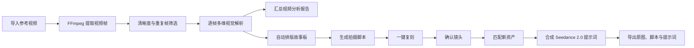

# 爆款复刻工作台：产品改造与 UI 设计基线

> 状态：设计阶段，待确认后进入正式开发  
> 适用项目：`filmstoryboard`  参考方案：`docs/项目改造方案.md`  
> 参考规范：`docs/解析维度.csv`、`docs/SD2提示词规则.md`、`docs/拍摄脚本模版.xlsx`

> UI 排版请以 [一键复刻UI布局确认版.md](一键复刻UI布局确认版.md) 为准；本文件保留产品流程、数据模型和实施规划。

## 1. 产品定位

将当前“故事板拼图”软件改造为面向短视频、广告和剧情内容的“爆款复刻工作台”。用户提供一条参考视频和一组新的角色/产品/场景资产，软件完成以下闭环：



### 1.1 目标

- 把参考视频拆解为可编辑的镜头、画面、节奏和营销分析数据。
- 自动去除重复或模糊视频帧，只保留能够表达场景、动作和叙事变化的焦点帧。
- 让故事板、拍摄脚本和“一键复刻”共享同一批镜头数据，避免重复录入。
- 生成符合 `docs/SD2提示词规则.md` 的多模态视频提示词，并明确绑定角色、场景、道具等参考素材。
- 能够导出 Excel 分析报告、拍摄脚本、脚本原图和最终提示词，方便交给外部视频生成工具继续生产。

### 1.2 第一阶段边界

- 第一阶段负责视频导入、抽帧、解析、故事板、脚本和提示词生成；不直接实现第三方视频生成服务的排队、计费和成片回传。
- “一键复刻”以截图所示的三步工作流为核心：确认镜头 → 准备资产 → 合成提示词。
- 外部服务采用 OpenAI 兼容的视觉模型接口。默认模型和地址可在设置中配置；API Key 只能保存在本机配置或系统环境中，禁止写入仓库、示例文档和 Git 历史。
- 现有项目工程、数据库和故事板数据必须可迁移；主菜单中的“多宫格裁切”改为“视频解析”。旧裁切数据和底层服务只作为已有工程兼容能力保留，不再占用主菜单入口。

## 2. 产品信息架构

### 2.1 主导航

沿用当前 `AppShell` 的窗口标题栏和页面切换机制。功能菜单提供“底部”和“左侧”两种同源布局，按钮样式、页签顺序、选中状态和页面路由完全一致；用户在设置页选择后即时生效并持久化。工程快捷入口、教程入口和设置入口均保留。

导航职责按下面的方式扩展：

| 顺序 | 菜单 | 主要职责 | 现有能力复用 |
| --- | --- | --- | --- |
| 现有 | 设计分镜图 | 保留现有图像生成能力 | `story_design` |
| 改造 | 视频解析 | 替代原“多宫格裁切”主入口；导入视频、提取帧、逐帧解析、导出多维度报告 | `video_analysis` |
| 现有 | 故事板拼图 | 展示焦点帧、编辑镜头顺序和故事脉络 | `storyboard` |
| 现有 | 导出故事板 | 保留现有故事板导出能力，并增加新导出入口 | `exporter` |
| 新增 | 拍摄脚本 | 管理脚本、编辑镜头字段、导出脚本和原图 | `shooting_script` |
| 新增 | 一键复刻 | 三步完成新资产匹配和提示词合成 | `replicate` |
| 现有 | 设置 | 模型、FFmpeg、导出、更新和隐私配置 | `settings` |

底部和左侧菜单均复用同一份页签定义以及 `_TabButton` 的高度、圆角、图标、选中态和 tooltip 规则。切换布局不能重建业务状态或改变当前页面。

### 2.2 全局视觉语言

三张参考图只用于确定“信息组织方式”：顶部三步进度、镜头表格、资产分组卡片和最终提示词表；不作为新的全局配色或组件设计来源。所有新页面必须沿用当前 `AppTheme` 和现有页面容器：

- 颜色从 `Theme.of(context).colorScheme` 读取，不在新页面硬编码新的背景、主色或状态色；继续支持当前浅色和深色主题。
- 继续使用 Material 3、当前字体回退、`CardThemeData`、`FilledButton`、`IconButton` 和 `InputDecorationTheme`。
- 面板沿用现有 `surfaceContainerLow`、`outlineVariant`、8px 圆角、细边框和 12–14px 内边距的组合；不引入新的卡片体系。
- 页面外层沿用现有 `Padding`、`LayoutBuilder`、`Row/Column`、`AnimatedSwitcher` 和可滚动区域的组织方式。
- 新增表格、stepper 和资产卡片只补充业务内容，优先复用已有按钮、输入框、图片预览、空模块和状态提示组件。
- 全局组件继续提供空数据、处理中、成功、失败和部分完成五种状态；耗时操作显示进度、阶段和重试入口，但不改变现有状态视觉。

**禁止事项：** 不替换全局主题、不重做窗口标题栏、不让两套菜单产生不同路由、不因参考截图是深色而取消浅色主题、不在新功能中引入独立的设计系统。

## 3. 核心数据流与处理策略

### 3.1 视频抽帧策略

不默认把视频逐帧发送给大模型。采用“候选帧提取 → 质量评分 → 感知去重 → 解析 → 镜头聚合”的流水线：

1. 使用 FFmpeg 读取视频元数据，记录时长、分辨率、帧率和音轨信息。
2. 使用场景变化检测提取候选关键帧；对于镜头变化不明显的片段，使用可配置的时间间隔补帧。
3. 为每帧计算清晰度、亮度、运动变化和感知哈希，过滤严重模糊、全黑、重复或近重复画面。
4. 将保留帧按原始视频文件名建立独立目录，文件名包含顺序和时间戳，例如 `00012-00m04s320ms.jpg`。
5. 先逐帧解析，再按小批次汇总相邻帧，不把整条视频一次性发送给模型。
6. 当相邻帧的场景、主体、动作或构图发生明显变化时，建立新的镜头组；镜头组中选择一张清晰焦点帧作为故事板主图，其余帧作为可展开的候选帧。

默认策略建议：`场景变化 + 1 秒补帧 + 感知去重`。短视频可在设置中切换为“高保真逐帧采样”，用于验证逐帧与关键帧在实际素材上的效果。

### 3.2 逐帧解析与汇总

视觉模型调用分为三层，三层结果均需要落盘，支持中断恢复：

| 层级 | 输入 | 输出 | 目的 |
| --- | --- | --- | --- |
| 帧级 | 单张保留帧 + 邻近帧上下文 | 画面、主体、动作、构图、光影、运镜等 | 保留可追溯的原始事实 |
| 镜头级 | 同一镜头组的帧级结果 | 镜头起止、主图、动作变化、对白和音效摘要 | 消除相邻重复帧 |
| 视频级 | 全部镜头级结果 + 音频/文本摘要 | 故事脉络、结构、营销维度、报告数据 | 形成可销售分析和脚本生产的结论 |

模型失败时只重试失败帧，不重跑全部任务。界面中显示“已完成 / 处理中 / 待重试 / 已跳过”数量。

### 3.3 多维度报告字段

`docs/解析维度.csv` 是报告字段的来源，界面和导出必须保持以下分组：

| 报告分组 | 字段 |
| --- | --- |
| 开头 3 秒分析 | 开场类型、黄金 3 秒内容、留存钩子 |
| 内容结构 | 视频结构、镜头节奏、信息密度 |
| 产品植入 | 出现时间、产品展示方式、卖点表达 |
| 视觉分析 | 场景、画面风格、色彩 |
| 用户心理 | 刺激点、购买理由 |
| 转化设计 | CTA、福利、评论引导 |

报告主文件命名为`<视频文件名>视频多维度分析报告.xlsx`，至少包含：`概览`、`镜头明细`、`多维度分析`、`模型原始结果`四个工作表。除 XLSX 外，同一份报告还必须支持 PDF、PNG、JPG 导出：PDF 为多页报告，PNG/JPG 按报告页输出。原始结果用于追溯，不在视觉报告中默认展开。

## 4. 页面 UI 布局

以下布局只描述现有页面内容区域内的组件排列，是正式开发时的组件拆分基线。页面外层必须继续挂在现有 `AppShell` 和 `_BottomTabs` 下；页面实现应优先复用现有项目的持久化、图片预览、故事板拖拽和导出能力，不在单个页面内重新实现数据层。

### 4.1 项目首页

```text
┌────────────────────────────────────────────────────────────────────┐
│ 当前工程：广告项目                         [新建] [打开] [设置]     │
├────────────────────────────────────────────────────────────────────┤
│ 最近工程                                                            │
│ ┌──────────────┐ ┌──────────────┐ ┌──────────────┐                 │
│ │ 项目封面/名  │ │ 项目封面/名  │ │ 新建项目     │                 │
│ │ 最近编辑时间 │ │ 最近编辑时间 │ │ 导入视频     │                 │
│ └──────────────┘ └──────────────┘ └──────────────┘                 │
│                                                                    │
│ 最近任务 / 解析进度 / 导出记录                                      │
└────────────────────────────────────────────────────────────────────┘
（底部页签由现有 AppShell 统一提供，本页不新增侧边导航）
```

- 保留现有工程创建、打开、重命名、迁移、导出和永久删除能力。
- 最近工程卡片增加“视频解析进度”“故事板数量”“脚本数量”三个摘要。
- 新建项目后可直接进入视频解析页；没有参考视频时，其他业务页显示引导空状态。

### 4.2 视频解析页

```text
┌────────────────────────────────────────────────────────────────────┐
│ 视频解析  参考视频：xxx.mp4       [导入视频] [重新解析]              │
│          [导出 xxx 视频多维度分析报告]                              │
├───────────────┬────────────────────────────┬───────────────────────┤
│ 视频信息      │ 帧时间轴 / 候选帧网格       │ 解析摘要              │
│ 时长 / 分辨率 │ [筛选] [仅焦点帧] [全部帧]    │ 解析进度  24/86        │
│ 帧率 / 音轨   │ ┌──┐ ┌──┐ ┌──┐ ┌──┐         │ 当前镜头：镜头 03     │
│ 抽帧策略      │ │01│ │02│ │03│ │04│         │ 画面描述              │
│ 间隔 / 场景阈值│ └──┘ └──┘ └──┘ └──┘         │ 多维度字段折叠面板    │
│ [开始提取]    │ 时间轴：|--●---●--●------|   │ [重试失败] [查看原文] │
│ [开始解析]    │                              │                       │
├───────────────┴────────────────────────────┴───────────────────────┤
│ 镜头分组：镜头 01  镜头 02  镜头 03 ...   [自动分组] [生成故事板]      │
└────────────────────────────────────────────────────────────────────┘
```

#### 交互要求

- 导入视频后先显示元数据和预计候选帧数量，用户确认后再开始提取。
- 帧卡片显示序号、时间戳、清晰度状态和解析状态；点击卡片在右侧查看全部解析维度。
- 支持按镜头、场景、解析状态筛选；支持批量标记为“保留故事板 / 跳过”。
- 解析任务可以暂停、继续和仅重试失败项；关闭页面后再次打开可以恢复。
- “生成故事板”只使用焦点帧和用户保留帧，不把全部候选帧直接铺入故事板。
- “导出 xxx 视频多维度分析报告”在视频级汇总完成前禁用；点击后打开格式选择对话框，提供 XLSX、PDF、PNG、JPG。
- PDF 输出多页报告；PNG/JPG 默认按报告页分别输出，文件名带页码；沿用现有导出清晰度、进度、取消和失败清理习惯。

### 4.3 故事板页

```text
┌────────────────────────────────────────────────────────────────────┐
│ 故事板：参考视频  [自动排版] [重新排序] [显示描述] [导出]           │
├─────────────────────────────────────────────┬──────────────────────┤
│ 镜头网格                                    │ 选中镜头检查器       │
│ ┌───────────┐ ┌───────────┐ ┌───────────┐   │ 镜头 03 / 00:04.320  │
│ │   主图    │ │   主图    │ │   主图    │   │ 场景、人物、动作     │
│ │ 镜头 01   │ │ 镜头 02   │ │ 镜头 03   │   │ 景别、构图、运镜     │
│ │ 画面描述  │ │ 画面描述  │ │ 画面描述  │   │ 光影、色彩、转场     │
│ └───────────┘ └───────────┘ └───────────┘   │ [编辑] [设为焦点帧]  │
│ ┌───────────┐ ┌───────────┐                 │                      │
│ │ 镜头 04   │ │ 镜头 05   │                 │ 故事脉络             │
│ └───────────┘ └───────────┘                 │ [自动生成] [编辑]    │
├─────────────────────────────────────────────┴──────────────────────┤
│ 画板管理：参考故事板  [+ 新建故事板] [复制] [重命名] [删除]           │
└────────────────────────────────────────────────────────────────────┘
```

- 保留当前故事板的拖拽排序、画板管理、描述编辑、图片预览、导出和自动解析能力。
- 每个镜头卡片下方显示“剧情脉络描述”，默认使用镜头级汇总文本，可手动改写。
- 主图与候选帧分离：点击镜头卡片可展开该镜头的候选帧，设置新的主图不会丢失原始帧。
- “自动排版”只调整镜头位置和网格列数，不改变镜头内容顺序；“重新排序”才允许调用视觉模型优化叙事顺序，并提供撤销。

### 4.4 拍摄脚本页

拍摄脚本参考 `docs/拍摄脚本模版.xlsx` 的 `LV1` 工作表，保留其十个核心列：`镜号、画面、内容、景别、运镜、摄影备注、基地场景、款号、图片、产品搭配`。

```text
┌────────────────────────────────────────────────────────────────────┐
│ 拍摄脚本  [脚本列表] [新建] [复制] [重命名]   [导出 XLSX] [导出原图] │
├──────────────┬─────────────────────────────────────────────────────┤
│ 脚本列表     │ 表格 / 预览 / 提示词 三种视图                        │
│ 参考视频脚本 │ ┌────┬────────┬────────┬────┬────┬───────────────┐ │
│ 新脚本       │ │镜号│画面    │内容    │景别│运镜│摄影备注       │ │
│ 已归档       │ ├────┼────────┼────────┼────┼────┼───────────────┤ │
│              │ │ 01 │ 缩略图  │ 可编辑 │中景│推镜│ 可编辑        │ │
│              │ └────┴────────┴────────┴────┴────┴───────────────┘ │
│              │ 横向滚动：基地场景 / 款号 / 图片 / 产品搭配          │
├──────────────┴─────────────────────────────────────────────────────┤
│ 选中镜头：参考资产、对白/旁白、音效、最终提示词、原图打开位置       │
└────────────────────────────────────────────────────────────────────┘
```

#### 交互要求

- 脚本拥有独立的 CRUD 和版本/归档状态，使用方式与当前画板管理一致。
- 表格支持行拖拽排序、复制镜头、插入镜头、删除镜头和批量修改。
- “画面”列显示原始焦点帧；“导出原图”导出每个镜头对应的原始图片，不使用截图或压缩后的预览图。
- 可从故事板一键生成脚本，也可手工创建空脚本。
- 导出的 Excel 第一行使用脚本名称，表头和列顺序与模板一致；新增字段（对白、音效、最终提示词）通过脚本附加页或配置开关导出，不能破坏官方模板的主表。

### 4.5 一键复刻页

一键复刻页面必须严格采用参考图的三步顶部流程。步骤状态和计数始终可见：

```text
┌────────────────────────────────────────────────────────────────────┐
│ 一键复刻：参考视频名                                                │
│ ① 确认镜头             ───── ② 准备资产             ───── ③ 合成提示词│
│    11个镜头已就绪             0/9 已生成                  0/11 已合成 │
├────────────────────────────────────────────────────────────────────┤
│ 当前步骤内容                                                        │
└────────────────────────────────────────────────────────────────────┘
```

#### 步骤一：确认镜头

页面对应参考图 1 的大表格。列固定为：

| 列 | 内容 |
| --- | --- |
| 镜号 | 镜头序号，支持拖拽排序 |
| 时长 | 从镜头组计算，可人工覆盖 |
| 画面描述 | 镜头级画面和动作描述 |
| 景别 | 远景、中景、近景、特写等 |
| 光影氛围 | 光线、色调、情绪 |
| 对白·旁白 | 识别结果，可人工修订 |
| 音效 | 环境声、音乐和关键音效 |
| 运镜 | 每个镜头优先只选择一种主要运镜 |
| 最终提示词 | 步骤三生成，未生成时显示待生成状态 |
| 操作 | 编辑、预览、删除、重置解析 |

顶部提供“全局风格”字段和镜头筛选。用户至少确认一条镜头后才能进入下一步；不合格或缺图的镜头需要明确标记，不能静默跳过。

#### 步骤二：准备资产

页面对应参考图 2，按资产类型分组：

```text
全局风格：[唐代/现代/国风/二次元] 暖橙金调高对比，强逆光剪影与丁达尔效应，厚涂插画质感...

角色
┌──────────┐ ┌──────────┐ ┌──────────┐       [+ 新增角色]
│ 生成/上传 │ │ 生成/上传 │ │ 生成/上传 │
│ 现代沈昭  │ │ 唐代沈昭  │ │ 顾怀柔   │
│ 角色描述  │ │ 角色描述  │ │ 角色描述  │
└──────────┘ └──────────┘ └──────────┘

场景
┌──────────┐ ┌──────────┐                         [+ 新增场景]
│ 金銮殿   │ │ 长安城   │
└──────────┘ └──────────┘

道具
┌──────────┐                                        [+ 新增道具]
│ 陌刀     │
└──────────┘
```

- 每张卡片必须同时支持上传图片、调用图像生成服务生成图片、替换图片、删除和编辑描述。
- 卡片右上角使用更多菜单，避免把删除按钮常驻在卡片正文中。
- 角色、场景、道具是逻辑类型，不把 Asset ID 直接写进最终提示词；提示词中使用模型可理解的 `图片1`、`图片2` 等素材编号。
- 素材数量按“被镜头引用数量”显示，例如 `角色 6/6`、`场景 2/2`；未被任何镜头引用的素材标为“未使用”。
- 推荐素材总数为 4–5 个：角色 1–2 张、场景 1 张、运镜参考视频 1 段、音频 1 段。超过推荐数量时只提示风险，不强制阻止。

#### 步骤三：合成提示词

页面对应参考图 3。表格复用步骤一的镜头列，但“最终提示词”列变为可编辑的宽文本单元格，并支持复制、单镜头重生成和批量合成。

提示词生成器必须按照以下顺序组织内容：

1. 明确角色、产品或道具主体以及素材引用。
2. 描述主体的具体动作、表情和动作过渡，避免只写抽象情绪。
3. 描述场景、位置关系、光影和色彩。
4. 指定景别和单一主运镜。
5. 按镜头 1、镜头 2、镜头 3 的时序组织动作。
6. 追加画质、视觉风格和约束词，默认包含“无字幕、无 Logo、无水印、人物不变形、动作连续”等可配置约束。

建议的可读输出结构：

```text
全局风格：{全局风格}
主体定义：将图片1中的{角色特征}定义为{主体名}；将图片2中的{场景特征}作为场景参考。

镜头1：{景别/运镜}，{主体}在{位置}执行{具体动作}，{表情与动作细节}，{光影氛围}。
镜头2：{镜头切换或运镜}，{动作承接}，{空间变化}，{对白/音效}。
...

整体约束：{画质}；{风格}；保持主体外观稳定；无字幕、无 Logo、无水印。
```

### 4.6 设置页新增区块

设置页增加以下分组，不显示或回填完整 API Key：

- 外观与布局：功能菜单位置（底部 / 左侧），切换后立即生效并记住用户选择。
- 视觉模型：兼容接口地址、模型名、请求并发、单帧超时、重试次数。
- 视频解析：FFmpeg 可执行文件、抽帧策略、场景阈值、补帧间隔、清晰度阈值。
- 提示词：全局风格默认值、默认约束词、素材引用策略、是否自动生成提示词。
- 导出：报告目录、脚本目录、原图目录、Excel 模板路径。
- 隐私：是否保留模型原始响应、日志脱敏、清理临时帧和失败缓存。
- 更新：沿用现有自动更新 / 手动更新 / 禁止更新三态。

## 5. 领域模型与持久化设计

### 5.1 新增领域实体

| 实体 | 关键字段 | 说明 |
| --- | --- | --- |
| `SourceVideo` | id、原始路径、项目内路径、时长、fps、宽高、音轨、状态 | 一个项目可有多个参考视频 |
| `VideoFrame` | id、videoId、序号、时间戳、路径、清晰度、哈希、选中状态 | 保存原始抽帧和质量评分 |
| `VideoShot` | id、videoId、序号、起止时间、主帧、候选帧、状态 | 镜头组，故事板和脚本的共同来源 |
| `MarketingAnalysis` | videoId、分组字段、原始响应、更新时间 | 对应 `解析维度.csv` |
| `ShootingScript` | id、名称、来源故事板、状态、版本、更新时间 | 脚本管理入口 |
| `ScriptShot` | scriptId、镜号、时长、画面、内容、景别、运镜、摄影备注、场景、款号、图片、产品搭配、对白、音效、提示词 | 对齐官方模板并补充业务字段 |
| `ReplicateRun` | id、来源视频/脚本、当前步骤、每步状态、统计、错误 | 一键复刻任务和恢复入口 |
| `ReplicateAsset` | runId、类型、名称、描述、路径、引用编号、状态 | 角色、场景、道具和其他参考素材 |
| `ShotPrompt` | runId、镜号、素材引用、提示词、模型、状态、原始响应 | 保存可编辑最终提示词 |

### 5.2 项目目录

在现有 `ProjectDirectories` 的基础上增加以下目录，所有路径都必须支持工程迁移时重写：

```text
<project>/
├─ videos/                 # 参考视频副本或受管路径
├─ frames/<video-id>/      # 原始候选帧、清洗后焦点帧
├─ analyses/<video-id>/    # 帧级/镜头级/视频级 JSON 与日志
├─ reports/                # 多维度解析 XLSX/PDF/PNG/JPG 报告
├─ scripts/                # 脚本快照、导出的 XLSX 和原图
├─ assets/                 # 角色、场景、道具等用户资产
├─ prompts/                # 最终提示词和可追溯版本
└─ database/project.sqlite
```

### 5.3 数据状态

统一使用显式状态，不通过空字符串推断：

```text
pending → running → completed
                 ├→ partial
                 └→ failed → retrying → running
```

页面关闭、应用重启和网络错误都不能让任务状态回到“未知”。任务记录必须包含开始时间、更新时间、完成数、失败数和可读错误。

## 6. 模型与提示词服务设计

### 6.1 视觉模型适配器

使用 OpenAI 兼容的 `/chat/completions` 适配器，模型配置来自设置，不在代码中硬编码私密凭据。适配器职责：

- 把本地图片转成模型支持的图片输入格式。
- 发送单帧或小批次请求，并设置超时、重试和并发上限。
- 校验 JSON 结构；模型返回不完整时记录原文并进入可重试状态。
- 将模型字段映射到 `VideoFrame`、`VideoShot` 和 `MarketingAnalysis`，保留 `rawResponse` 方便追溯。

### 6.2 提示词生成器

提示词生成器不是简单拼接描述，而是一个可测试的纯领域服务。输入为全局风格、镜头、资产和相邻镜头上下文，输出为结构化的 `ShotPrompt`。

必须遵守的规则：

- 角色/产品/场景先定义再引用；同一主体全程使用稳定名称。
- 不用 Asset ID 替代 `图片N` 或 `视频N` 引用。
- 每个镜头明确主体、动作、空间、运镜和音频。
- 一个镜头只指定一种主运镜，避免把推、拉、摇、移全部混在一处。
- 动作尽量写成低缓、连续、可执行的肢体动作，并表达动作过渡。
- 结尾统一追加画质、风格和约束词，可在设置中覆盖。

## 7. 实施模块与文件清单

### 7.1 现有模块的改造方向

| 现有模块 | 改造方向 |
| --- | --- |
| `lib/app/app_shell.dart` | 用视频解析替换旧裁切主入口；从同一份页签定义渲染底部或左侧菜单，保留工程关闭、更新和教程入口 |
| `lib/features/grid_cut` | 抽取视频帧的临时兼容实现；新业务逻辑迁移到 `video_analysis`，旧页面不立即删除 |
| `lib/features/storyboard` | 从裁切图故事板扩展为视频镜头故事板，支持焦点帧和候选帧 |
| `lib/features/exporter` | 增加分析报告、拍摄脚本和原图导出，复用现有 PNG/PDF 能力 |
| `lib/features/video_analysis/data/analysis_report_export_service.dart` | 生成多维度报告的 XLSX、PDF、PNG、JPG；复用现有图像渲染、JPG 转换和 PDF 写入能力 |
| `lib/features/story_design` | 作为现有图像生成能力保留，必要时改名为资产生成入口 |
| `lib/core/database/app_database.dart` | 增加迁移表和读写方法，所有变更必须兼容旧工程 |
| `lib/features/projects/data/project_directories.dart` | 增加视频、帧、分析、报告、脚本、资产和提示词目录 |
| `lib/features/settings` | 增加模型、FFmpeg、抽帧、提示词和隐私配置 |

### 7.2 新增建议目录

```text
lib/features/video_analysis/
├─ application/video_analysis_controller.dart
├─ data/ffmpeg_frame_extractor.dart
├─ data/frame_quality_service.dart
├─ data/video_analysis_repository.dart
├─ data/vision_frame_analysis_service.dart
├─ domain/video_analysis_models.dart
└─ presentation/video_analysis_page.dart

lib/features/shooting_script/
├─ application/shooting_script_controller.dart
├─ data/shooting_script_repository.dart
├─ data/shooting_script_export_service.dart
├─ domain/shooting_script_models.dart
└─ presentation/shooting_script_page.dart

lib/features/replicate/
├─ application/replicate_controller.dart
├─ data/replicate_repository.dart
├─ data/shot_prompt_generation_service.dart
├─ domain/replicate_models.dart
├─ presentation/replicate_page.dart
└─ presentation/widgets/
   ├─ replicate_stepper.dart
   ├─ shot_confirmation_table.dart
   ├─ replicate_asset_section.dart
   └─ final_prompt_table.dart
```

## 8. 分阶段开发计划

### 阶段 A：设计确认（当前）

- 确认产品命名、导航、三步流程和页面布局。
- 确认第一阶段是否只导出给外部视频生成工具，暂不接入第三方视频生成 API。
- 确认默认抽帧策略和模型服务配置方式。

验收：本文件通过审阅，关键交互没有未决冲突。

### 阶段 B：数据与视频解析基础

- 新增工程目录、数据库迁移和 `SourceVideo / VideoFrame / VideoShot` 模型。
- 集成 FFmpeg 元数据读取、抽帧、清晰度/感知去重和断点恢复。
- 实现视频解析页的空态、处理中、失败和完成态。

验收：导入一个视频后能生成可恢复的帧目录，重复帧不会全部进入故事板。

### 阶段 C：视觉解析与分析报告

- 将现有视觉服务拆成帧级、镜头级、视频级三个可测试服务。
- 接入 `解析维度.csv` 字段和本地 OpenAI 兼容模型。
- 输出多维度 Excel 报告，并提供 PDF、PNG、JPG 视觉报告和失败帧重试。

验收：模型失败只影响对应帧；报告四个工作表可打开，字段与 CSV 分组一致；PDF、PNG、JPG 均能生成可阅读的报告页。

### 阶段 D：故事板与拍摄脚本

- 故事板使用焦点帧自动排版，描述放到图片下方。
- 新增脚本 CRUD、表格编辑、排序、版本和原图导出。
- 对齐官方 `拍摄脚本模版.xlsx`，保留官方主表列顺序。

验收：故事板调整镜头顺序后，脚本可以重新生成且不会覆盖用户手工修改；导出原图路径可追溯。

### 阶段 E：一键复刻

- 实现三步 stepper、镜头确认表、资产卡片和最终提示词表。
- 实现素材引用编号、提示词规则校验、单镜头重试和批量合成。
- 打通故事板/脚本到一键复刻的导入，不重复选择镜头。

验收：截图中的三种主状态均可呈现；任一步骤关闭后重新打开可恢复；生成提示词不含裸 Asset ID。

### 阶段 F：全局质量与交付

- 补充控制器、领域服务、数据库迁移和页面 widget 测试。
- 运行 `flutter analyze`、相关 `flutter test`，验证 Windows 构建。
- 检查日志脱敏、临时目录清理、旧工程迁移和 GitHub Release 更新链路。

验收：新旧工程可打开，核心流程无阻断错误，工作区没有临时产物或凭据。

## 9. 验收清单

### 功能

- [x] 主菜单用“视频解析”替换“多宫格裁切”，旧工程裁切数据仍可迁移。
- [x] 设置页可切换底部/左侧功能菜单，切换即时生效且重启保持。
- [x] 视频可导入并按视频建立独立帧目录。
- [x] 可配置关键帧/补帧策略，候选帧可预览、筛选和重试。
- [x] 视觉解析按帧执行并可汇总，不因单帧失败阻断整条视频。
- [x] 多维度字段与 `解析维度.csv` 完全对应，并能导出 Excel 报告。
- [x] 视频解析页有“导出 `<视频名>` 多维度分析报告”按钮，并支持 XLSX、PDF、PNG、JPG。
- [x] PDF 为多页报告，PNG/JPG 按页输出并带页码，导出失败可重试且不残留临时文件。
- [x] 视频焦点帧生成的故事板在图片下方保留剧情描述，可编辑、排序和导出。
- [x] 拍摄脚本支持管理、编辑、导出脚本和导出原图。
- [x] 一键复刻三步流程与参考图一致，步骤计数和状态正确。
- [x] 最终提示词遵循 SD2 规则，角色/场景/道具引用稳定且可复制、可导出。

### 工程质量

- [ ] 当前工作树已清除 API Key、Cookie 和本机绝对路径；Git 历史中的旧凭据仍需服务端轮换，重写历史需单独确认。
- [x] 数据库迁移不破坏现有故事板和工程目录。
- [x] 长任务支持恢复、重试和可读错误。
- [x] 页面在 1280 × 720 和更宽窗口中不出现关键字段被裁切。
- [x] 所有新增控制器和领域服务有单元测试，关键页面有 widget 测试。
- [x] 变更完成后已清理临时视频帧、预览、冒烟测试运行数据和无用大文件；可复用构建缓存低于 20GB 上限。

## 10. 待确认事项

以下事项会影响实现范围，正式编码前需要确认：

1. 第一阶段是否只导出脚本、原图和提示词，还是要同步接入 LibTV/Seedance 的视频生成 API？
2. 参考视频的默认抽帧策略是否采用“场景变化 + 1 秒补帧 + 感知去重”，还是优先保留所有逐帧结果？
3. 视觉模型服务是否始终运行在本机/内网，还是需要同时支持公网 HTTPS 和代理配置？
4. 新仓库和发布包中是否允许保留原项目名称“故事板”，还是从窗口标题、工程格式和导出文件名全部改成“爆款复刻”？
5. 资产生成是否复用当前图像生成服务，还是只允许上传已有的角色、场景和道具图片？

在这些事项确认前，不进行会锁死产品方向的第三方视频生成接口、数据库最终结构或大范围导航重构。
